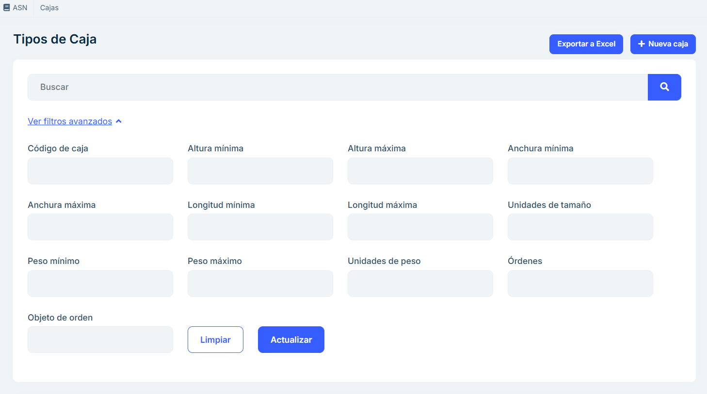

# 2.2.2 Boxes

**2.2.2.1 Overview**

The boxes section allows you to manage all boxes registered in the system. Users can 
search, filter, edit, delete, export and create new boxes in an intuitive way. This module 
is designed to ensure efficient management of boxes and their characteristics.

**2.2.2.2 Main features**

#### 2.2.2.2.1 Seeker 

The search field allows you to quickly locate boxes by entering text related to their main 
characteristics, such as name, type of box or any other relevant data.

#### 2.2.2.2.2 Advanced Filters 
The Advanced Filters drop-down menu allows you to perform more specific searches by 
applying different criteria. 
 
Available criteria include: 
 
- Box code. 
- Minimum height. 
- Maximum height. 
- Minimum width. 
- Maximum width. 
- Minimum length. 
- Maximum length. 
- Units of size. 
- Minimum weight. 
- Maximum weight. 
- Units of weight. 
- Orders. 
- Object of order.

Once the filters are set, users can press the Refresh button within the panel to have the checkout 
list automatically updated, displaying only the results that meet the selected criteria.

#### 2.2.2.2.3 List of Boxes 

- A table is displayed with all the boxes existing in the system. 

- Each row in the listing represents a box and includes information such as: 

    - Box code. 
    - Dimensions (height/width/length). 
    - Units of size. 
    - Weight (G/N). 
    - Units of weight. 

- Each box has two action buttons associated with it: 

Edit: Open a form to modify the characteristics of the selected box. 

Delete: Allows you to delete the box after confirming the action.

#### 2.2.2.2.4 Export to Excel

- By clicking the Export to Excel button, an Excel file will automatically be downloaded with the 
information of the boxes shown in the list. 

- The downloaded file is saved in the browser's default download folder. 

#### 2.2.2.2.5 Create New Box 

- This button allows you to register a new box in the system. 

- When selected, a form is displayed in which users must enter the required information: 

    - Box name: An identifying name that makes the box easily recognizable. Example: "Large Box #1", "Electronics Box". Helps organize and quickly locate the box in an inventory or management system. 

    - Width: The horizontal measurement of the box when viewed from the front. Units may be specified in centimeters, inches, meters, or other units depending on configuration. For example: 30 cm, 12 inches. This is key to determining how much space the box will take up, especially in storage or transport. 

    - Height: The vertical measurement of the box from the base to the top. The units of measurement are similar to width, specified in cm, inches, etc. This data is necessary to calculate the total volume of the box and to verify its suitability in spaces with height restrictions. 

    - Length: The horizontal measurement of the box from front to back. It is measured in the same units as the width and height. Example: 40 cm, 16 inches. Together with the width and height, it determines the volume and space needed for storage. 

    - Size units: Specifies the measurement system used for box dimensions. Example: Centimeters (cm), inches (in), meters (m). Unifies measurements and prevents errors when mixing different unit systems. 

    - Gross weight: The total weight of the box, including its contents, packaging, and any additional materials. Units: Kilograms (kg), pounds (lb), etc. Example: 12 kg, 26 lb. This is critical for calculating shipping costs and complying with maximum weight regulations. 
    
    - Net weight: The weight of the box's contents, not including packaging. Units: Same unit as gross weight (kg, lb, etc.). Example: 10 kg, 22 lb. Useful for determining the value of contents, especially in trade and inventories. 

    - Weight units: A system of measurement for weight (kilograms, pounds, etc.). Example: kg, lb. Ensures consistency in measurements and prevents errors in interpretation, especially in international contexts. 

- The form includes validations to ensure the integrity of the data before saving it. 

    Together, these fields ensure that boxes can be properly identified, measured, weighed, and transported. They facilitate logistics, warehousing, inventory, and trade by providing all the key information about the physical characteristics of each box. 

    <b>The box needs to be created here so that it is recorded in the system and can be made available later in the packaging section, ensuring that the correct specifications are used in subsequent processes.</b>

#### 2.2.2.2.6 Frequently Asked Questions

<b>What information is displayed on the box listing?</b>

The box listing shows key information for each registered box, including: 

- Unique box code. 
- Dimensions (width,length, height). 
- Units of size. 
- Weight. 
- Units of weight. 

<b>How can I search for a specific box?</b>

You can search for a specific box using the search field. Enter any of the following data: 

- Box code. 
- Order number. 
- Dimensions or any other relevant characteristics.

<b>How can I edit or delete a box?</b>

Each box in the listing includes two buttons: 

Edit: Allows you to modify the box's characteristics. Clicking on this opens an editable form. 

Delete: Deletes the system box. This action requires confirmation to prevent accidental deletions.

<b>How can I register a new box?</b>

To create a new box:

Click the Create New Box button. Fill in the form with the necessary data (dimensions, material, 
condition, etc.). Save the changes to register the box in the system.

<b>What happens if I try to save a box with incorrect data?</b>

The creation and editing form includes validations that ensure the data is correct. If you enter 
incorrect information or mandatory fields are missing, the system will display an error message 
indicating the necessary adjustments before saving. 

<b>What should I do if I can't find a box that should be registered? </b>

If you can't find a box: 

Check to see if any filters have been applied that may be hiding it. Try searching for it by its unique 
ID, code, or other distinguishing feature. If the box still doesn't appear, confirm with your system 
administrator whether it has been deleted or archived.

<b>How to create an Excel document? </b>

Click on the Export to Excel button at the top right. An Excel file will automatically download with 
the information of the boxes shown in the list. 

