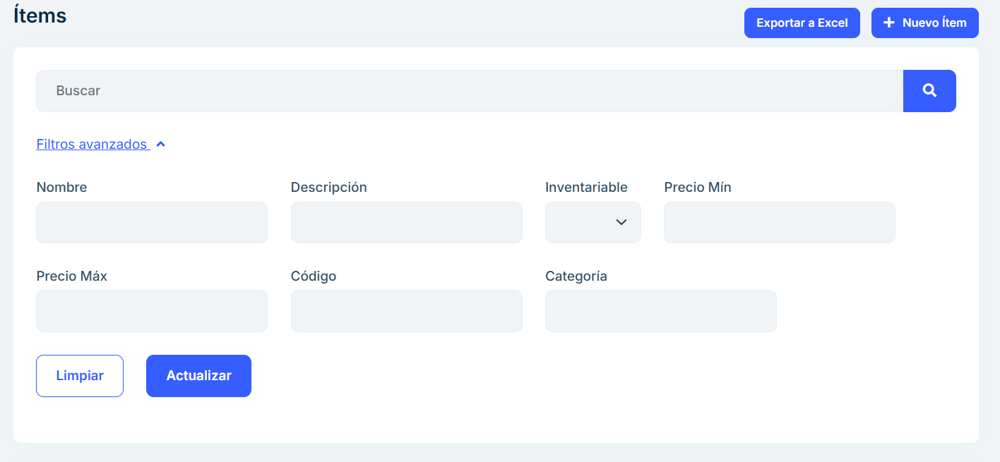
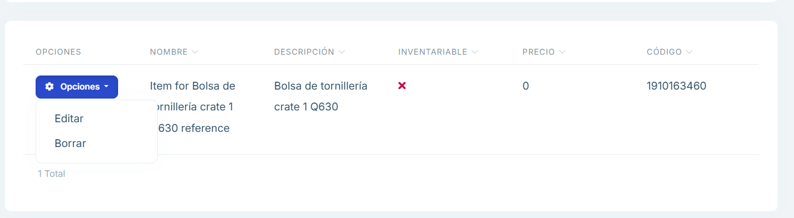

# 2.2.9 Items

**2.2.9.1 Overview**

In the inventory items section we can modify the items registered in the system. 

When an item is imported for the first time, it will be registered with the code and name 
used by TKE. In this section we can modify these characteristics. 

In this way, the supplier will be able to use its own nomenclature for the elements of the 
purchase orders, while the system will maintain the reference to the nomenclature used 
by TKE to use it when notifying or generating labels. 

On this screen, we can see a list of all the items existing in the system. 

 
Filtering options are available for different fields.

To modify, we must click on Options and then on Edit. 

This will open a model where we can make changes to various characteristics of the 
article. Afterwards, when we click on Save, these changes will be saved in the system.

 

 