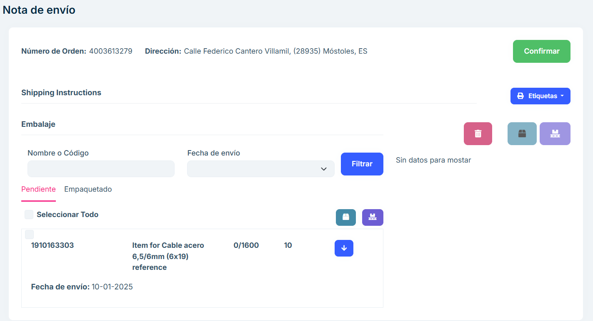
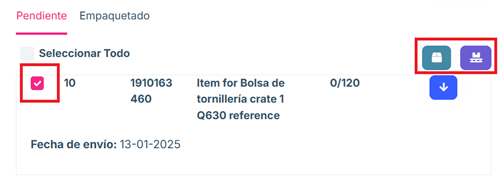
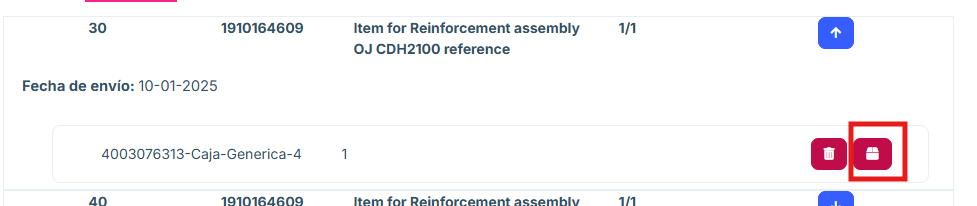
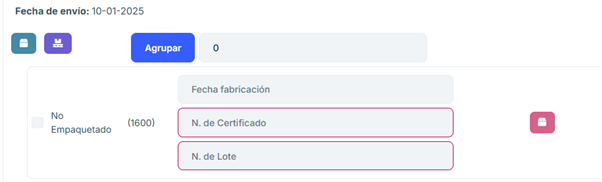
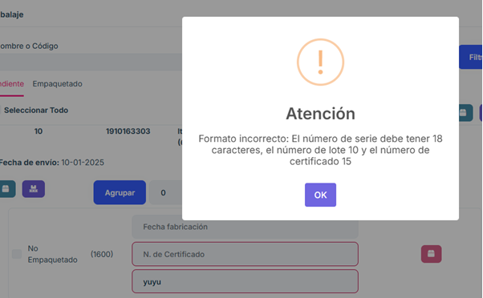
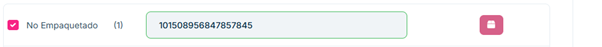

# 2.2.5 Package

**2.2.5.1 Overview**

In the "Package" section we have access to the orders that have been previously con
firmed in the Jaggaer system, have been received by the ASN 2.0 system and are ready 
to begin the packaging process. 

In this section, you can only select orders individually. If you want to combine boxes from 
different orders, you can do so later in the application. 

In the Packaging section, a list of the packages made is displayed, providing the order 
number, the address to which it is being sent, the number of boxes to be sent and a 
"Delivery Notes" options button. 

**2.2.5.2 Main features**

#### 2.2.5.2.1 Seeker

- Allows you to search the list by the order number and shipping address attributes.

#### 2.2.5.2.2 Shipping note 

- Clicking the "Delivery Notes" button on any of the packages displays the Delivery Note page 
where you can see the package that is pending packaging or already packaged. Each item consists of:

  - The position of the order (in this case 10). 
  - The item number (in this case it is 1910163303) .
  - The item name (Item for Steel Cable 6.5/6mm (6x19) reference). 
  - The number of items to pack (0/1600). 
  - Date of shipment. 

#### 2.2.5.2.3 Earring 

- If the package is pending, it allows you to display a menu in which you can choose the number 
of pallets and boxes you want to package, grouping the number of items you want until you 
get the total described for the items to be sent. 

- The number of items per box or pallet must be entered and the application itself provides a 
list with the groups of items. A batch number can be proposed to identify the package.

#### 2.2.5.2.4 Boxes 

- You can choose whether you want to create boxes with the elements. 

- A menu appears that allows you to insert the chosen items into an existing box searched for 
in the search engine or to create a new box and insert the chosen items into it.

- If the number of groups to be packaged is not entered, the packaging menu appears with the 
total number of batches to be packaged.

- To assign items to a box, press "+ New box" and this menu will appear. You can assign a box 
to each item or assign a box to all items by clicking the check above the menu. 

#### 2.2.5.2.5 Pallets

- To pack items on pallets, you will need to select the desired items from the list and press the 
button to group them on pallets. 

- In the same way as boxes, when converted into pallets, a menu appears that allows you to 
put them in an existing pallet or create a new pallet to store them there.

- To create a pallet, click on "+ New pallet" and this menu will appear. You can assign a pallet 
to each item or assign a pallet to all items using the tick above the menu. 

#### 2.2.5.2.6 Packing a position 

- You can select a complete position, or several, and pack it in its entirety using the pallet and 
box buttons on the right. To select it, you must use the check mark on the left of the position. 
This option is only available for positions in which no item subdivision has been generated. 
With the "Select all" option we will select all the positions that can be selected to pack in this 
way.	

#### 2.2.5.2.7 Packaging 

- When all the items in the "Pending" section are placed in boxes or pallets, they appear in this 
list, providing the possibility of unpacking the items on the list.

  Any of the items can be unpacked using the following icon.

#### 2.2.5.2.8 Package List 

- On the right side of the page you will find the list of boxes and pallets created for the shipment. 
You can edit the data of the pallet or box itself and view the items that make it up.

- Selecting one of the items on this list allows you to delete them and, if they are boxes, allows 
you to put them in a box or on a pallet. 

<b>If you confirm the order but have not finished packing the entire list of items, the list of 
pending items will appear in the list of the "Partial Shipments" section of the application.</b>

Using the "Labels" button you can create a PDF of existing items and boxes.

#### 2.2.5.2.9 Single level packaging 

You can group everything with the maximum order or place it in boxes where the 
maximum quantity will appear. 

#### 2.2.5.2.10  Packaging with lot number 

Items must be grouped and the batch number, certificate number and 
manufacturing date must be entered manually for each group. If the batch or 
certificate number is missing, the order cannot be confirmed. It can be completed 
in the “Packaging” section and the order can be confirmed. 

Entering a certificate or batch number with the incorrect format will appear a message advising its correct format:

If the format is correct it will look like this:

#### 2.2.5.2.11  Packed with many positions 

In this case, you can take all the items and pack each one in a box. If a batch 
number is required, it will not allow packaging unless it is entered manually. 

From the packaging list you can add pallets. You can remove the labels from the 
shipments.

#### 2.2.5.2.12 Packaging with serial number 

The corresponding serial number is placed on each of the items. It is packed in 
boxes. each item is grouped on a pallet that, by removing the ASN, goes to 
“Pending Shipment”. 

If you do not enter a serial number in the correct format, a message will appear:

If correct, it will appear like this and allow you to package it: 

#### 2.2.5.2.13 Frequently Asked Questions 

<b>How to search for an order? </b>

At the top of the page there is a search engine that allows you to search by any of its main attrib
utes. 

<b>How do I leave a pending package in the packaging section? </b>

Each item has a list of the products to be packaged, it must be grouped into a group and the 
products must be chosen to be put into boxes or on pallets depending on what is desired. 

This will cause it to show up in the listing on the right side of the page and in the packaging section, 
ready for you to confirm. 

<b>Why does the website not work when I remove a tag? </b>

If you remove a tag, you must cancel the tag to continue working on the website. 

