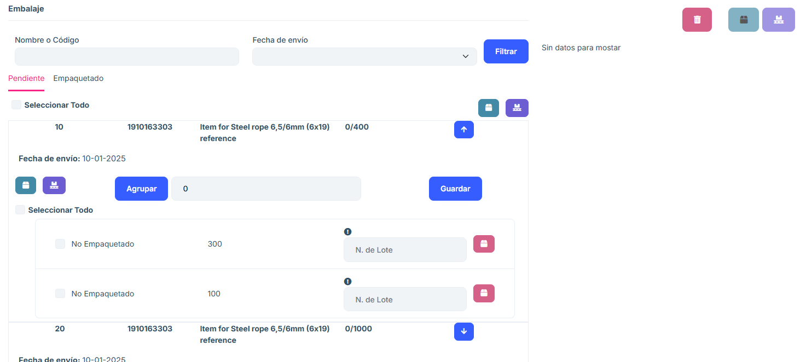
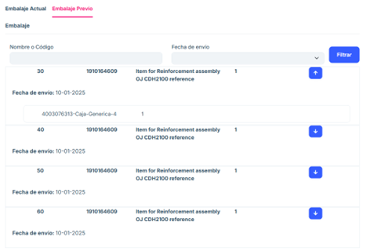

# 2.2.7 Partial shipments

**2.2.7.1 Overview**

The Partial Shipments section allows you to manage and consult orders that are in the 
process of partial shipment. That is, those purchase orders of which some items have 
been pre-packaged, but not all. 

Provides tools for ordering and viewing order details, as well as managing associated 
packaging. 

**2.2.7.2 Main features**

#### 2.2.7.2.1 Order search by order number and order address  

Press the Update button to filter the list of orders by the data entered or press the 
Clear button to empty the filled fields in the search engine. 

#### 2.2.7.2.2 List of Purchase Orders 

- Displays all purchase orders in partial shipment status. 

- Each row includes key information such as: 

   - Order Number: Unique identifier of the order. 
   - Shipping address: Destination associated with the order. 
   - Boxes: number of boxes contained in the order. 
   - Options: Each purchase order in the listing includes a Delivery Note button. When you 
   press this button, the user is redirected to a new tab to manage the packaging associated 
   with the selected order.
   
#### 2.2.7.2.3 Matter 

Pressing the Import button opens a tab from which you can either drag Excel files to add 
to the list, or add them from the computer's own file browser.

#### 2.2.7.2.4 Delivery Note Tab

- Current packaging

- Packaging Finder 

Search criteria: 

   - Name or code of the packaging. 
   - Date of shipment. 
   - Action Buttons: 
      Filter: Filter the list of packages according to the criteria entered. 
   - List of packaging 

Displays the packaging associated with the selected purchase order. 

Each row in the listing includes information such as: 

   - Name or code of the packaging. 
   - Date of shipment 
   - Other relevant packaging details. 

   The operation of the "Delivery Note" section consists of the same packaging scheme as in the "Package" of this document.

#### 2.2.7.2.5 Pre-packaging 

In the pre-packaging section, what has already been packed for that order is shown, and 
the quantity shown in current packaging is the pending quantity, that is, for an order item 
the total quantity would be the current packaging + pre-packaging, but the system sepa
rates them. 

#### 2.2.7.2.6 Frequently Asked Questions 

<b>What information does the order list show? </b>
 
The order listing shows the following key columns: 
- Order Number: Unique identifier of the order. 
- Shipping address: Destination associated with the order. 
- Boxes: number of boxes contained in the order. 
- Options: Each purchase order in the listing includes a Delivery Note button. When you press 
this button, the user is redirected to a new tab to manage the packaging associated with the 
selected order. 
   
<b>How can I search for a specific order? </b>

You can use the search engine located at the top of the window: 
Enter the Order Number or Shipping Address in the fields provided. Click the Refresh button to 
filter the results. If you wish to clear the search fields, use the Clear button. 

<b>What does the "Delivery Note" button do? </b>

The Delivery Note button redirects to a new tab where you can: 

View the packaging associated with the selected order. Use an additional search engine to locate 
packaging by: 
- Name or Code 
- Date of shipment. 
- View a list of packaging and its specific details.

<b>What information does the packaging list show? </b>

The packaging list includes: 

Package Name or Code: Unique identifier for the package. Shipment Date: Date the package was 
processed or scheduled for shipment. Additional Details: Other relevant data. 

<b>How do I know if an order is partially shipped? </b>

In the main list, orders displayed in the Partial Shipments section correspond only to those that 
have not been completely shipped. Each order in this section has an associated status of "Partial".

<b>What to do if an order does not appear in the list? </b>

If an order does not appear:

Please verify that you have entered the correct data into the search engine. 

Make sure you clicked the Refresh button after entering your search criteria. If the problem per
sists, please contact your system administrator to verify if the order has been completed or ar
chived. 

<b>How to upload your own Excel file to the listing? </b>

Press the Import button. A screen will appear from which you can drag your file into the central box 
provided for this purpose. Alternatively, within this same screen, press the Choose Files tab to be 
able to choose the desired file from the file browser on your own computer.