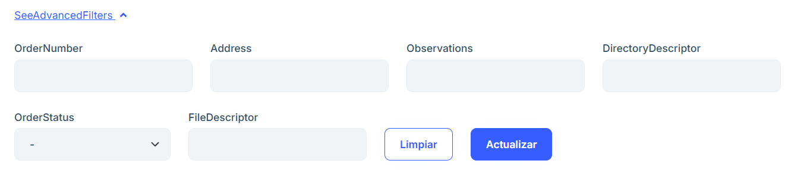
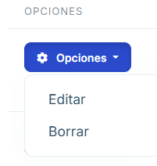
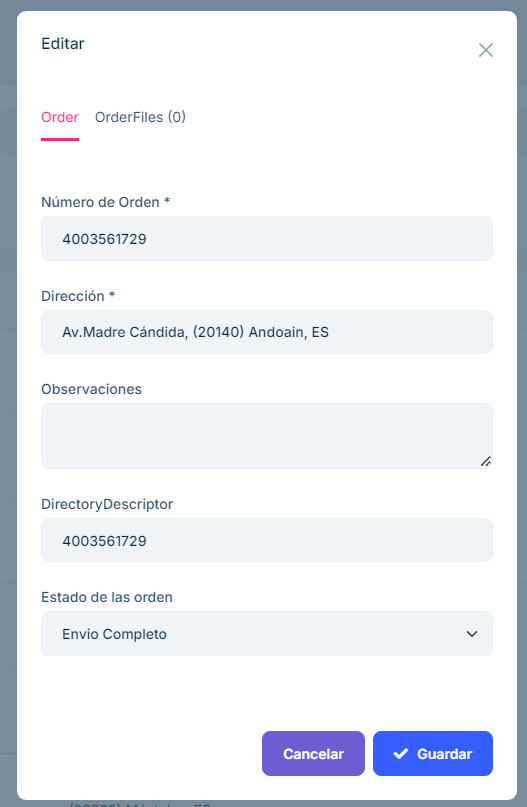

# 2.2.4 Pedidos de compra

**2.2.4.1 Descripción general**

En el apartado de Pedidos de compra se visualiza un listado de los pedidos realizados proporcionando el número de pedido, la dirección a la que se envía, la fecha de la solicitud, el número de directorio, el estado del pedido, además de un botón de opciones para editar y eliminar un pedido.

**2.2.4.2 Funcionalidades principales**

#### 2.2.4.2.1 Buscador y filtros

- Encima del listado se encuentra un buscador que permite buscar el texto insertado en cualquiera de los apartados.

- En la sección SeeAdvancedFilters del buscador, al pulsarlo, se encuentra un filtrado más en particular para cada uno de los atributos que componen cada pedido.

#### 2.2.4.2.2 Opciones

- El botón "Opciones" de cada pedido abre un desplegable que permite editar y borrar un pedido. 

- Al editar un pedido permite modificar cualquier atributo del pedido elegido.

#### 2.2.4.2.3 Exportar y crear pedido

- Encima del buscador se encuentra unos botones que permiten exportar como excel los pedidos y crear un nuevo pedido en caso de desearlo.

- A la hora de crear un nuevo pedido aparece un menú con la posibilidad de rellenar todos los atributos que componen el pedido.

#### 2.2.4.2.4 Preguntas frecuentes
<b>¿Cómo filtrar o buscar una orden específica?</b>
Existe un buscador y filtrado de las diferentes ordenes por cada atributo que lo componen en la parte superior del listado.

<b>¿Se puede sacar un excel del listado de ordenes?</b>
En la parte superior de la página existe un botón de llamado "ExportToExcel" para crear un excel con las diversas ordenes mostradas en la lista.

<b>¿Se puede crear una nueva orden?</b>
Existe un botón en l aparte superior de la página que se llama "NewOrder" que permite mediante un menú crear un a nueva orden y proporcionarle los atributos necesarios.

{width=679 height=492}

<b>¿Cómo editar o borrar una orden?</b>
Mediante el botón "Opciones" se permite editar y/o borrar cualquiera de las ordenes ya existentes.

Y al clicar en "Editar" se despliega un menú que permite editar cualquiera de los atributos de la orden.

