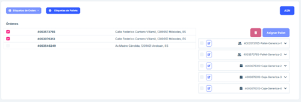
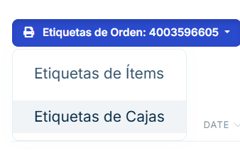
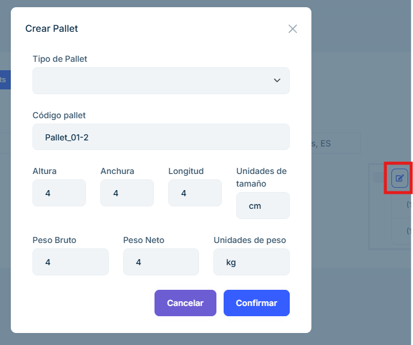

# 2.2.6 Pending shipment

**2.2.6.1 Overview**

The Pending Shipment section is the last step before confirming the packaging of a ship
ment. From this module, users can check pending orders, assign pallets to said orders 
and generate labels and documents necessary for the logistics process. This section 
allows boxes from different purchase orders to be combined on the same pallet, if nec
essary because that is how said orders have been packaged. 

**2.2.6.2 Main features**

#### 2.2.6.2.1 List of Pending Shipments

- A list is presented that includes key information for each pending shipment: 

  - Order Number: Unique identifier of the shipment. 
  - Date: Date of order. 
  - Address: Destination address of the shipment. 
  - Number of Boxes: Total number of boxes associated with the shipment. 

- This list allows you to select one or more purchase orders to perform additional actions. 

  If there are two or more orders with the same destination, they can be sent together, 
  and the list with the pallets and boxes of the combined orders will be placed on the 
  right of the page.

#### 2.2.6.2.2 Pallet and box management 

- Selecting an order number in the list enables a drop-down menu that shows the available 
pallets and boxes with the following information: 

  - Unique pallet identifier. 
  - Number of boxes on each pallet
   
- Users can add one or more pallets to the selected shipment by associating them with the 
order. To do this, select the pallet you want to add to the selected order number and press the 
'Assign Pallet' button. 

#### 2.2.6.2.3 Label generation 

- Once the orders have been selected, the following buttons are enabled for generating labels: 
Item and Box Labels: Generates individual labels for the items and boxes included in the 
shipment. 

- Pallet Labels: Generates labels to identify the pallets associated with the shipment. 

#### 2.2.6.2.4 ASN Generation 

- Press the ASN button to create the shipping notification document. 

  - When you press it, all the boxes to be sent must be placed on pallets. If they are not in this way, this error will appear: 

  In the case where the boxes have been inserted into pallets, when clicking on the "ASN" button a confirmation message appears indicating that the process has been successful. 

#### 2.2.6.2.5 Frequently Asked Questions 

<b>How can I remove a pallet or box from the order? </b>

To delete a pallet or box, select the desired one and click on the delete button.

<b>Can a pallet or box be edited? </b>

Any pallet or box can be edited using the edit button and within the menu that appears. 

<b>How do you create an order ASN? </b>

In order for the application to allow the creation of the ASN, a tick must be placed on an order 
and the entire order must be on pallets. If part of the order is not on pallets, a tick will be placed 
on the boxes and the "Add Pallet" button will be pressed to create a pallet with them. 

