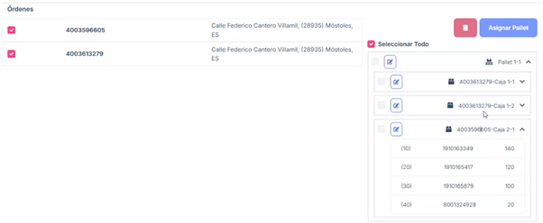

# 2.2.8 Shipping 

**2.2.8.1 Overview**

The Shipments section is designed to manage and monitor shipments within the system. 
It includes two main views: Pending and Shipped, allowing clear and structured control 
of the status of each shipment. 

**2.2.8.2 Main features**

#### 2.2.8.2.1 Available Views

- Pending: Displays a list of shipments that have not yet been processed or shipped. 

- Sent: Presents a list of the shipments that have already been managed and marked as sent. 

#### 2.2.8.2.2 Navigation between views

Users can switch between the Pending and Sent tabs to view items in each status.

#### 2.2.8.2.3 Earring 

List of Pending Shipments: 

- A list of shipments not yet processed is presented. 

Each row includes the following information: 

- ID: Unique identifier of the shipment. 

- Shipment Number: Shipment code or reference number. 

- Action Buttons: Information: Provides additional details about the shipment. When clicked, a 
pop-up or modal opens with relevant information. Labels: Generates and allows downloading 
labels for the corresponding shipment. Send: Changes the status of the shipment to "Sent" 
and automatically moves it to the Sent tab. Available Actions.

#### 2.2.8.2.4 Sent 

List of Sent Shipments: 

Similar to the listing on the Pending tab, but only shows shipments that have already 
been processed and shipped. 

Each row includes: 

- ID: ASN identifier. 

- Shipment Number: Shipment code or reference number. 

- Date of shipment. 

- Action Buttons: Information: Provides additional details about the shipment. When clicked, a 
pop-up or modal opens with relevant information. Labels: Generates and allows downloading 
labels (item, box, pallet, and packing slip) for the corresponding shipment. Shipped: Informa
tion about the status of the shipment.

This view acts as a record of completed shipments, allowing you to review them at any 
time.

#### 2.2.8.2.5 Joint shipments 

When packing orders into boxes, you are allowed to select all shipments for grouping them 
and then put them on a pallet (if they have the same destination).

#### 2.2.8.2.6 Frequently Asked Questions

<b>What information is displayed in the Shipping section?</b>

The Shipping section contains two main tabs: 

Pending: Displays shipments that have not yet been processed, including the following 
details: 
- Shipment ID.

- Shipment Number.

- Action buttons: Information, Labels, and Send. 

Sent: Displays shipments that have already been processed, with the same information 
fields.

<b>What actions can I perform from the "Pending" tab? </b>

From the Pending tab, you can: 

- View detailed shipment information by clicking the Information button. 

- Generate labels for items and boxes using the Labels button. 

- Mark a shipment as complete and move it to the Sent tab using the Send button. 

<b>How can I view a shipment that has already been processed? </b>

To check shipments that have already been processed: 

- Go to the Sent tab.

- Locate the shipment you need. 

- Select the shipment to view its details or generate labels again.

<b>What does the "Information" button do? </b>

The Information button displays ASN (Advanced Shipping Notice) details for the selected 
shipment.

<b>What happens when I press the "Send" button on the Pending tab?</b>

Pressing the Send button will: 

- Change the shipment status from Pending to Sent. 

- Automatically move the shipment from the Pending tab to the Sent tab. 

- Maintain a clear record of completed shipments.

<b>Can I generate labels for already completed shipments? </b>

Yes, you can generate labels again from the Sent tab using the Labels button associated 
with each shipment. 

<b>What is the difference between the "Pending" and "Sent" tabs? </b>

Pending: Contains shipments that have not yet been processed or completed. These can 
still be managed using the Send and Labels actions. 

Sent: Contains shipments that have already been processed and marked as completed. 
Here, you can only view shipment details or generate labels again. 