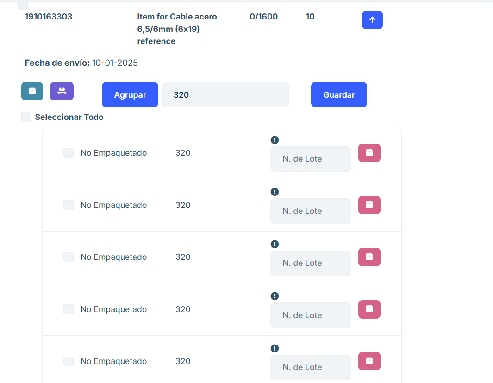
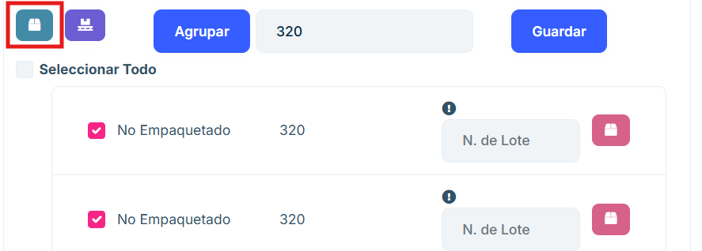
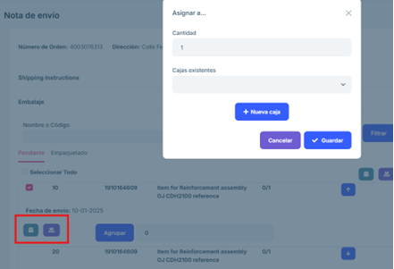
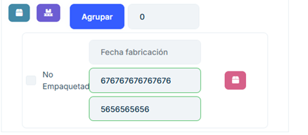
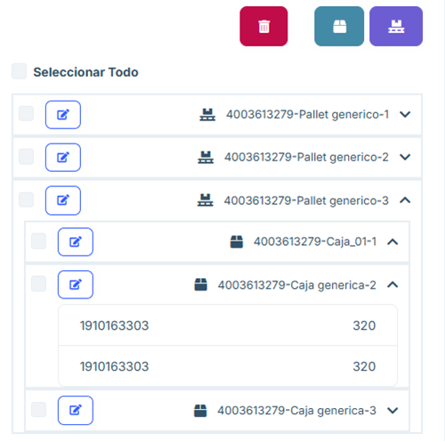
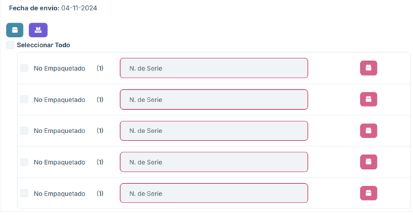
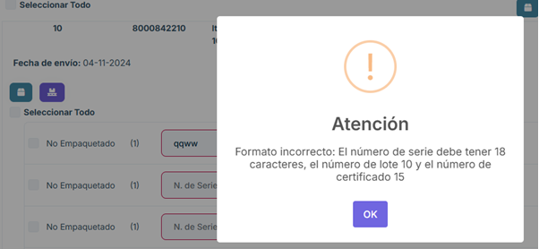
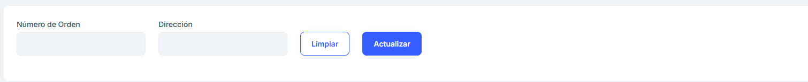

# 2.2.5 Empaquetar

**2.2.5.1 Descripción general**

En el apartado "Empaquetar" tenemos acceso a las órdenes que han sido previamente confirmadas en el sistema de Jaggaer, han sido recibidas por el sistema de ASN 2.0 y están listas para comenzar el proceso de empaquetado. 

En este apartado, sólo se pueden elegir órdenes individualmente. Si queremos juntar cajas de distintas órdenes, se podrá hacer más adelante en el aplicativo.  

En el apartado de Empaquetar se visualiza un listado los paquetes realizados proporcionando el número de pedido, la dirección a la que se envía, el número de cajas a enviar y un botón de opciones "Delivery Notes".

**2.2.5.2 Funcionalidades principales**

#### 2.2.5.2.1 Buscador

- Permite realizar búsquedas en el listado por los atributos de número de orden y dirección de envío.

#### 2.2.5.2.2 Nota de envío

- Al pulsar el botón "Delivery Notes" en cualquiera de los paquetes se visualiza la página de Nota de envío en la que se puede ver el paquete que está pendiente de empaquetar o ya empaquetado.

- La posición de la orden (en este caso el 10) 

- El número del ítem (en este caso es 1910163303) 

- El nombre del ítem (Item for Cable de Acero 6,5/6mm (6x19) reference) 

- El número de ítems a empaquetar (0/1600) 

- Fecha de envío.

#### 2.2.5.2.3 Pendiente

- En caso de que el paquete esté como pendiente permite desplegar un menú en el que se puede elegir el número de pallets y de cajas que se quiere empaquetar, agrupando el número de items que se desean hasta conseguir el total descrito de los items a enviar.

- Se debe colocar el número de items por caja o pallet y la propia aplicación proporciona un listado con los grupos de items. Se puede proponer un número de lote identificador del paquete.

#### 2.2.5.2.4 Cajas

- Se puede escoger si se desean crear cajas con los elementos.

- Aparece un menú que permite insertar los items elegidos en una caja existente buscada en el buscador o crear una nueva caja e insertar en ella los items escogidos.

- En caso de no colocar el número de grupos para empaquetar aparece el menú para empaquetar con el número total de los lotes a empaquetar.

- Para crear una caja se realiza pulsando "+ Nueva caja" y aparece este menú. Se puede asignar a una caja a cada item o asignar una caja a todos los items mediante el tick de encima del menú.

#### 2.2.5.2.5 Pallets

- Para empaquetar los items en pallets será necesario elegir los lotes del listado que se desean y presionar el botón para agruparlos en pallets.

- De la misma manera que las cajas al convertirlos en pallets aparece un menú aue permite meterlos en un pallet ya existente o crear un nuevo pallet para almacenarlos ahí.

- Para crear un pallet se realiza pulsando "+ Nuevo pallet" y aparece este menú. Se puede asignar a un pallet a cada ítem o asignar un pallet a todos los ítems mediante el tick de encima del menú.

#### 2.2.5.2.6 Empaquetar una posición

- Se permite seleccionar una posición completa, o varias, y empaquetarla en su totalidad utilizando los botones de pallet y caja a la derecha. Para seleccionarla, debemos usar el check que tiene la posición a la izquierda. Esta opción sólo está disponible para posiciones en las cuales no se ha generado ninguna subdivisión de ítems. Con la opción "Seleccionar todo" seleccionaremos todas las posiciones que se puedan seleccionar para empaquetar de esta manera.

#### 2.2.5.2.7 Empaquetado

- En el momento en el que se meten en cajas o pallets todos los items del apartado "Pendientes" aparecen en este listado, proporcionando la posibilidad de desempaquetar los los items del listado.

  Se puede desempaquetar cualquiera de los ítems mediante el siguiente icono. 

#### 2.2.5.2.8 Listado de paquetes

- A la derecha de la página se encuentra el listado de las cajas y pallets creados para el envío. Se permite editar los datos del propio pallet o caja y visualizar los items que los componen.

- Al seleccionar uno de los elementos de este listado permite eliminarlos y en caso de ser cajas permite meterlas en una caja o en un pallet.

<b>En caso de confirmar el pedido pero no acabar de empaquetar todo el listado de items el listado de los items pendientes aparecerán en el listado de la sección "Envíos parciales" del aplicativo. </b>

Mediante el botón "Etiquetas" se puede sacar un pdf de los items y las cajas existentes.

#### 2.2.5.2.9 Empaquetado a un solo nivel 

Se podrá agrupar todo con el máximo del pedido o colocarlo en cajas aparecerá la cantidad máxima. 

#### 2.2.5.2.10 Empaquetado con número de lote 

Se deberá agrupar los ítems y en cada grupo se deberá introducir de forma manual el número de lote, el número del certificado y la fecha de fabricación. En caso de que falte por colocar el número de lote o de certificado no se permitirá confirmar el pedido, se puede completar en la sección de “Empaquetado” y así poder confirmar el pedido.  

Colocando un número de certificado o de lote con el formato incorrecto aparecerá 	un mensaje aconsejando su formato correcto: 

En caso de que el formato sea correcto se verá de esta manera: 

#### 2.2.5.2.11 Empaquetado con muchas posiciones 

En este caso se puede coger todos los elementos y empaquetar a cada uno en un a caja. En caso de necesitar número de lote no permitirá el empaquetado de esta manera si no se coloca manualmente. 

Desde el listado de empaquetados se puede ir agregando en pallets. Se puede sacar las etiquetas de los envíos. 

#### 2.2.5.2.12 Empaquetado con número de serie 

Se coloca el número de serie correspondiente a cada uno de los ítems. Se empaqueta en cajas 	cada ítem y se agrupa en un pallet que sacando el ASN pasa a “Pendientes de Envío”. 

En el caso de no colocar un número de serie con el formato correcto saldrá un mensaje: 

En caso correcto aparecerá de esta manera y permitirá empaquetarlo: 

#### 2.2.5.2.13 Preguntas frecuentes

<b>¿Cómo buscar una orden?</b>
En la parte superior de la página existe un buscador que permite hacer una búsuqeda por cualquiera de sus atributos principales.

<b>¿Cómo dejar en la sección de empaquetados un paquete pendiente?</b>
Cada item posee un listado de los productos a empaquetar, se deberá agrupar en un grupo de ellos y se debe elegir los productos para meterlos en cajas o en pallets dependiendo de los que se desee.

Eso hará que se muestre en el listado de la derecha de la página y en la sección de empaquetados, listo para confirmar.

<b>¿Por qué al sacar una etiqueta luego no funciona la web?</b>
En caso de sacar una etiqueta, para seguir trabajando en la web se deberá cancelar la etiqueta.

