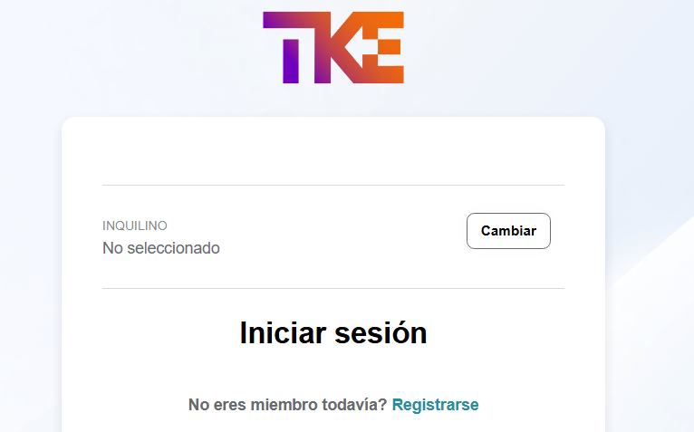

# Inquilino

El campo de inquilino permite la selección de la empresa en particular a la cual querremos acceder. Es importante destacar que cada cliente/proveedor tiene su propio inquilino que es el nombre de la empresa en mayúsculas, deberemos antes de hacer el inicio de sesión elegir el inquilino adecuado. 

Pulsaremos el botón “Cambiar” de la página de login y nos saldrá un desplegable donde deberemos de introducir el nombre de nuestra empresa en mayúsculas. 

