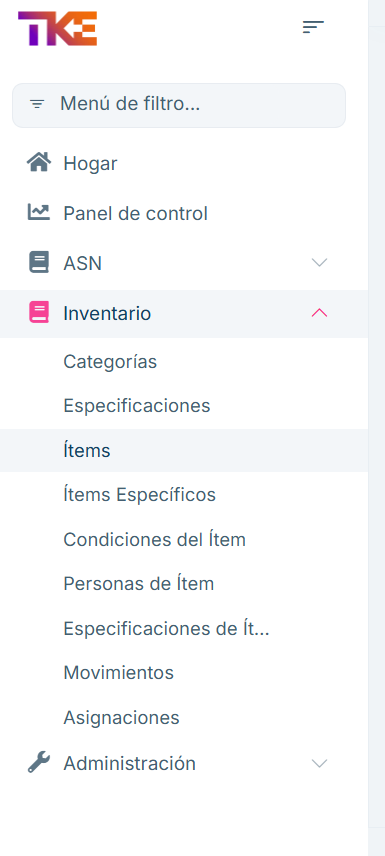
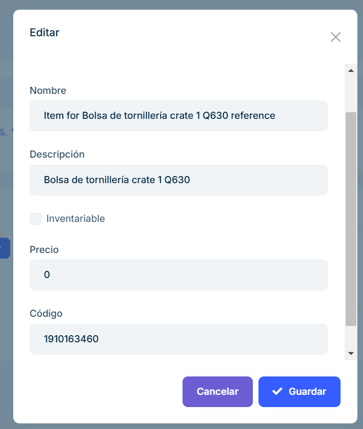

# 2.2.9 Ítems

**2.2.9.1 Descripción general**

En el apartado ítems de inventario podremos modificar los ítems registrados en el sistema. 

Cuando un ítem es importado por primera vez, se registrará con el código y nombre que utiliza TKE. En este apartado podremos modificar esas características. 

Así, el proveedor podrá utilizar su propia nomenclatura para los elementos de los pedidos de compra, mientras que el sistema mantendrá la referencia a la nomenclatura usada por TKE para utilizarla a la hora de notificar o generar etiquetas. 

En esta pantalla, podremos ver un listado de todos los ítems existentes en el sistema. 

 
Se dispone de opciones de filtrado por distintos campos 

Para modificar, debemos clicar en Opciones y después en Editar. 

Esto nos permitirá abrir un modal, donde podremos hacer modificaciones a distintas características del artículo. Después, al clicar en Guardar, se registrarán dichos cambios en el sistema. 

 

 