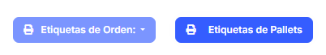
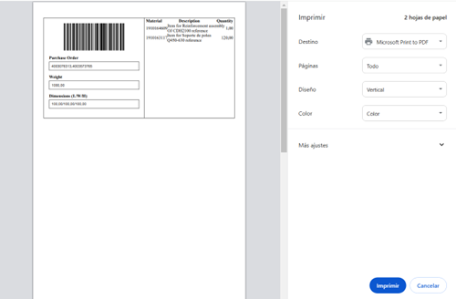
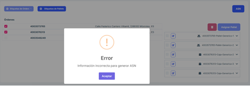
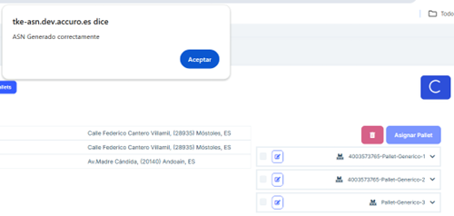

# 2.2.6 Pendientes de envío

**2.2.6.1 Descripción general**

El apartado Pendientes de Envío está diseñado para gestionar los envíos que aún no han sido completados. Desde este módulo, los usuarios pueden consultar los pedidos pendientes, asignar pallets a dichos pedidos y generar etiquetas y documentos necesarios para el proceso logístico. Este apartado permite juntar cajas de distintos pedidos de compra en un mismo pallet, si así se necesita porque así se han empaquetado dichos pedidos. 

**2.2.6.2 Funcionalidades principales**

#### 2.2.6.2.1 Listado de Envíos Pendientes

- Se presenta un listado que incluye información clave de cada envío pendiente:

   - Número de Orden: Identificador único del envío.
   - Fecha: Fecha del pedido.
   - Dirección: Dirección de destino del envío.
   - Número de Cajas: Total de cajas asociadas al envío.

- Este listado permite seleccionar un envío específico para realizar acciones adicionales.

  En caso de existir una dos o más ordenes con el mismo destino se podrán mandar en conjunto, y se colocará a la derecha de la página el listado con los pallets y las cajas de las ordenes juntas.

#### 2.2.6.2.2 Gestión de pallets y cajas

- Al seleccionar un envío o un número de orden en el listado, se habilita un desplegable que muestra los pallets disponibles con la siguiente información:

   - Identificador único del pallet.
   - Número de cajas en cada pallet.
   
- Los usuarios pueden añadir uno o más pallets al envío seleccionado, asociándolos al pedido. Para ello seleccione el pallet que quiere añadir al número de orden seleccionado y presione el botón 'Agregar Pallet'.

#### 2.2.6.2.3 Generación de etiquetas

- Una vez seleccionadas las ordenes, se habilitan los siguientes botones para la generación de etiquetas:
Etiquetas de Artículos y Cajas: Genera etiquetas individuales para los artículos y las cajas incluidas en el envío.

- Etiquetas de Pallets: Genera etiquetas para identificar los pallets asociados al envío.

#### 2.2.6.2.4 Generación de ASN

- Presione el botón ASN para crear el documento de notificación de envío.

  En el momento de presionarlo se debe colocar todas las cajas a enviar en pallets, en caso de que no estén de este modo aparecerá este error: 

  En el caso en el que se hayan insertado las cajas en pallets, al pulsar en el botón "ASN" aparece el mensaje de confirmación que indica que ha ido el proceso correctamente. 

#### 2.2.6.2.5 Preguntas frecuentes

<b>¿Cómo puedo eliminar un pallet o caja de la orden?</b>
Para eliminar un pallet o caja se debe seleccionar el que se desea y clicar en el botón borrar.

<b>¿Se puede editar un pallet o caja?</b>
Se puede editar cualquier pallet o caja en el botón de edición y dentro del menú que aparece.

<b>¿Cómo se crea el ASN de una orden?</b>
Para que la aplicación permita crear el ASN se debe poner tick en una orden y es necesario que esta esté en pallets todo el pedido. En caso de no estar parte del pedido en pallets, se colocará un tick de las cajas y se pulsará el botón "Agregar Pallet" para crear un pallet con estas.

